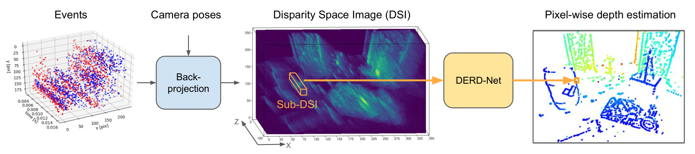
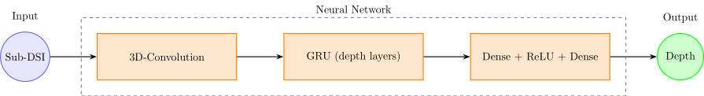
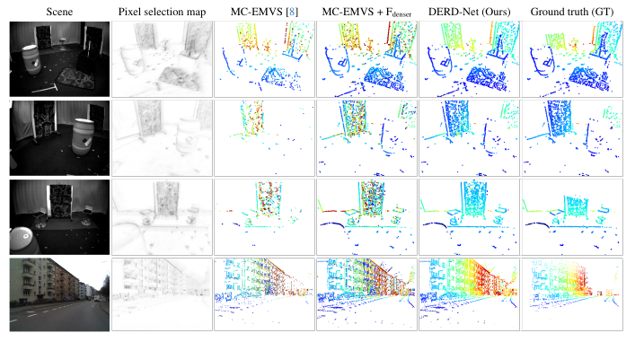

# DERD-Net: Learning Depth from Event-based Ray Densities (NeurIPS 2025 Spotlight)

Official repository for [DERD-Net: Learning Depth from Event-based Ray Densities](https://arxiv.org/pdf/2504.15863), by [Diego Hitzges](https://www.linkedin.com/in/diego-de-oliveira-hitzges-410943276/)\*, [Suman Ghosh](https://www.linkedin.com/in/suman-ghosh-a8762576/)\*, and [Guillermo Gallego](http://www.guillermogallego.es).

\*Equal contribution.

<!--## [Paper](https://arxiv.org/pdf/2504.15863) | [Video]() --->

If you use this work in your research, please cite it as follows:

```bibtex
@InProceedings{Hitzges25neurips,
  title     = {{DERD-Net}: Learning Depth from Event-based Ray Densities},
  author    = {Hitzges, Diego and Ghosh, Suman and Gallego, Guillermo},
  booktitle = {Advances in Neural Information Processing Systems (NeurIPS)},
  year      = {2025}
}
```

## Framework

<div align="center">
  
</div>

#### Data-Preprocessing

- Create Disparity Space Images (DSIs) from events and camera pose
- In case of stereo event vision, fuse DSIs from two or more cameras
- Select pixels with sufficient ray counts in the DSI

#### Input

- Local subregion of the DSI around each pixel (Sub-DSI)
- Each Sub-DSI is one data point and processed independently and parallely by the network

#### Neural Network

<div align="center">
  
</div>

#### Output

- Pixel-wise depth estimation for each Sub-DSI:
  - Single value at selected pixel for single-pixel network version
  - 3x3 grid at selected and 8-neighboring pixels for multi-pixel network version

## Results
<p align="center">
  <strong>Drones (MVSEC)</strong>
</p>

<div align="center">
  
</div>
<br>

Using three-fold cross-validaton on the MVSEC <em>indoor_flying</em> sequences, our approach drastically outperforms comparable methods:

- Using purely monocular data, our method achieves comparable results to existing _stereo_ methods.
- When applied to stereo data, it strongly outperforms all state-of-the-art (SOTA) approaches, reducing the mean absolute error by at least 42%.
- Our method also allows for increases in depth completion by more than 3-fold while still yielding a reduction in median absolute error of at least 30%.

<p align="center">
  <strong>Driving (DSEC)</strong>
</p>
<div align="center">
  
</div>
<!--
<div align="center">
  
</div>
-->

<!--Superiority in performance of our method was further confirmed by retraining and testing on the DSEC sequence <em>zurich_city_04a</em>.--->

## Installation & Usage

The code for our approach is provided in Jupyter Notebooks, each of which contains detailed usage instructions. They are located in the [`notebooks`](https://github.com/tub-rip/DERD-Net/tree/main/notebooks) folder and cover the following functionalities:

- [Training and testing](https://github.com/tub-rip/DERD-Net/blob/main/notebooks/Training_and_Testing.ipynb)
- [Inference and runtime analysis](https://github.com/tub-rip/DERD-Net/blob/main/notebooks/Inference.ipynb)
- [Visualization of depth maps](https://github.com/tub-rip/DERD-Net/blob/main/notebooks/Visualization.ipynb)

To use these notebooks, follow the installation guide below:

#### 1. Clone the Repository
```
git clone https://github.com/tub-rip/DERD-Net.git
cd DERD-Net
```

#### 2. Set Up the Environemnt

We provide an [`environment.yml`](https://github.com/tub-rip/DERD-Net/blob/main/environment.yml) file to ensure compatibility with all dependencies. It can be installed using [Conda](https://docs.conda.io/projects/conda/en/stable/user-guide/getting-started.html).

```
conda env create -f environment.yml
conda activate derdnet_env
```

#### 3. Launch Jupyter Notebook

The following command opens the Jupyter interface in your browser. You can then open and run the notebooks listed above.
```
jupyter notebook
```

If you are new to Jupyter, see this quick [beginner’s guide](https://jupyter-notebook.readthedocs.io/en/stable/notebook.html) to help you get started.

## Models

Pretrained models are available in the [`models`](https://github.com/tub-rip/DERD-Net/tree/main/models) folder. These include weights for both the single-pixel and multi-pixel versions of DERD-Net. They can can be used directly within the provided Jupyter notebooks:

- Simply place the desired `.pth` file from the [`models`](https://github.com/tub-rip/DERD-Net/tree/main/models) directory.
- The model will be automatically loaded as specified in the corresponding notebook.

## Generating Input DSIs
Disparity Space Images (DSIs) can be obtained by running [dvs_mcemvs](https://github.com/tub-rip/dvs_mcemvs) with the parameter `save_dsi=true` in the config file, like in [this&nbsp;example](https://github.com/tub-rip/dvs_mcemvs/tree/main/mapper_emvs_stereo/cfg/upenn_mvsec/mvsec_flying1_full/alg1_with_dsi). Please note that saving DSIs occupy significant disk space.

For a quick start, sample DSIs from the [MVSEC](https://daniilidis-group.github.io/mvsec/) `flying1` sequence are provided [here](https://tubcloud.tu-berlin.de/s/ak2t9zZ5CmibAnD).

## License
This work is released under [MIT License](LICENSE).

## Related Works

* **[Event-based Stereo Depth Estimation: A Survey (TPAMI 2025)](https://arxiv.org/pdf/2409.17680)**
* **[MC-EMVS: Multi-Event-Camera Depth Estimation and Outlier Rejection by Refocused Events Fusion (AISY 2022)](https://github.com/tub-rip/dvs_mcemvs)**
* [ES-PTAM: Event-based Stereo Parallel Tracking and Mapping (ECCVW 2024)](https://github.com/tub-rip/ES-PTAM)
   
## Additional Resources on Event-based Vision

* [Research page (TU Berlin, RIP lab)](https://sites.google.com/view/guillermogallego/research/event-based-vision)
* [Course at TU Berlin](https://sites.google.com/view/guillermogallego/teaching/event-based-robot-vision)
* [Survey paper](http://rpg.ifi.uzh.ch/docs/EventVisionSurvey.pdf)
* [List of Resources](https://github.com/uzh-rpg/event-based_vision_resources)
