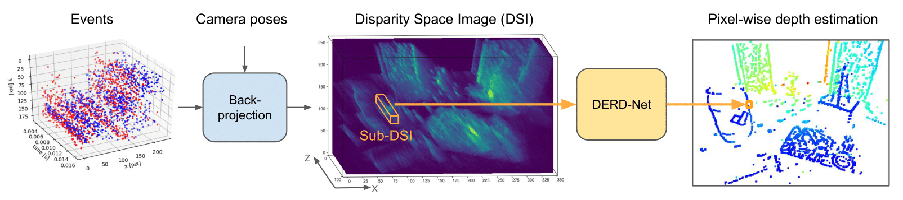
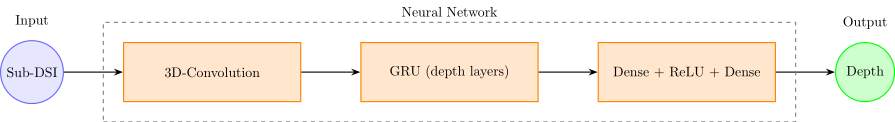

# DERD-Net: Learning Depth from Event-based Ray Densities

Official repository for [DERD-Net: Learning Depth from Event-based Ray Densities](https://arxiv.org/pdf/2504.15863), by [Diego de Oliveira Hitzges](https://www.linkedin.com/in/diego-de-oliveira-hitzges-410943276/), [Suman Ghosh](https://www.linkedin.com/in/suman-ghosh-a8762576/), and [Guillermo Gallego](https://sites.google.com/view/guillermogallego), preprint published at arXiv.

## [Paper](https://arxiv.org/pdf/2504.15863) | [Video]()

If you use this work in your research, please cite it as follows:

```bibtex
@article{hitzges2025derd,
  title={DERD-Net: Learning Depth from Event-based Ray Densities},
  author={Hitzges, Diego de Oliveira and Ghosh, Suman and Gallego, Guillermo},
  journal={arXiv preprint arXiv:2504.15863},
  year={2025}
}
```

## Framework

<div align="center">
  
</div>

#### Data-Preprocessing

- Create disparity space images (DSIs) from events and camera pose
- In case of stereo event vision, fuse DSIs from two or more cameras
- Select pixels with sufficient ray counts by applaying a threshold filter to each DSI

The approach of usind DSI was originally proposed in the [MC-EMVS](https://onlinelibrary.wiley.com/doi/10.1002/aisy.202200221) paper. To construct DSIs, refer to the associated repository, [dvs_mcemvs](https://github.com/tub-rip/dvs_mcemvs).

#### Input

- Local subregion of the DSI around each pixel (Sub-DSI)
- Each Sub-DSI is one data point and processed independently and parallely by the network

#### Neural Network

<div align="center">
  
</div>

#### Output

- Pixel-wise depth estimation for each Sub-DSI
- Single value at selected pixel for single-pixel network version
- 3x3 grid at selected and neighboring pixels for multi-pixel network version

