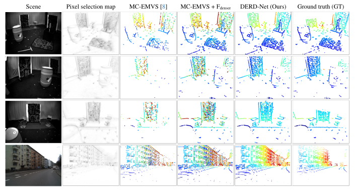

# DERD-Net: Learning Depth from Event-based Ray Densities

Official repository for [DERD-Net: Learning Depth from Event-based Ray Densities](https://arxiv.org/pdf/2504.15863), by [Diego de Oliveira Hitzges](https://www.linkedin.com/in/diego-de-oliveira-hitzges-410943276/)\*, [Suman Ghosh](https://www.linkedin.com/in/suman-ghosh-a8762576/)\*, and [Guillermo Gallego](https://sites.google.com/view/guillermogallego).

\*Equal contribution.

<!--## [Paper](https://arxiv.org/pdf/2504.15863) | [Video]() --->

If you use this work in your research, please cite it as follows:

```bibtex
@article{hitzges2025derd,
  title={DERD-Net: Learning Depth from Event-based Ray Densities},
  author={Hitzges, Diego de Oliveira and Ghosh, Suman and Gallego, Guillermo},
  journal={arXiv preprint arXiv:2504.15863},
  year={2025}
}
```

## Framework

<div align="center">
  
</div>

#### Data-Preprocessing

- Create Disparity Space Images (DSIs) from events and camera pose
- In case of stereo event vision, fuse DSIs from two or more cameras
- Select pixels with sufficient ray counts in the DSI

#### Input

- Local subregion of the DSI around each pixel (Sub-DSI)
- Each Sub-DSI is one data point and processed independently and parallely by the network

#### Neural Network

<div align="center">
  
</div>

#### Output

- Pixel-wise depth estimation for each Sub-DSI:
  - Single value at selected pixel for single-pixel network version
  - 3x3 grid at selected and neighboring pixels for multi-pixel network version

## Results
<p align="center">
  <strong>Drones (MVSEC)</strong>
</p>

<div align="center">
  
</div>

Using 3-fold cross-validaton on the MVSEC <em>indoor_flying</em> sequences, our approach drastically outperforms comparable methods:

- Using purely monocular data, our method achieves comparable results to existing _stereo_ methods.
- When applied to stereo data, it strongly outperforms all state-of-the-art (SOTA) approaches, reducing the mean absolute error by at least 42%.
- Our method also allows for increases in depth completion by more than 3-fold while still yielding a reduction in median absolute error of at least 30%.

<p align="center">
  <strong>Driving (DSEC)</strong>
</p>
<div align="center">
  
</div>
<!--
<div align="center">
  
</div>
-->

<!--Superiority in performance of our method was further confirmed by retraining and testing on the DSEC sequence <em>zurich_city_04a</em>.--->

## Code

The code for our approach is provided in Jupyter Notebooks, each of which contain a detailed usage instruction. They are contained within the [notebooks](https://github.com/tub-rip/DERD-Net_dev/tree/main/notebooks) folder, providing the following functionalities:

- [Training and testing](https://github.com/tub-rip/DERD-Net_dev/blob/main/notebooks/Training_and_Testing.ipynb)
- [Inference and runtime analysis](https://github.com/tub-rip/DERD-Net_dev/blob/main/notebooks/Inference.ipynb)
- [Visualization of depth maps](https://github.com/tub-rip/DERD-Net_dev/blob/main/notebooks/Visualization.ipynb)

Our [environment.yml](https://github.com/tub-rip/DERD-Net_dev/blob/main/environment.yml) can be used for installing necessary dependencies using [Conda](https://docs.conda.io/projects/conda/en/stable/user-guide/getting-started.html).

## Models

Our trained models are provided in the folder [models](https://github.com/tub-rip/DERD-Net_dev/tree/main/models).

## Related Works

- [MC-EMVS: Multi-Event-Camera Depth Estimation and Outlier Rejection by Refocused Events Fusion](https://github.com/tub-rip/dvs_mcemvs)
- [Event-based Stereo Depth Estimation: A Survey](https://arxiv.org/pdf/2409.17680)
- [ES-PTAM: Event-based Stereo Parallel Tracking and Mapping](https://github.com/tub-rip/ES-PTAM)
